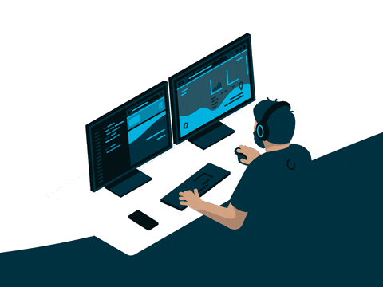

  

###

 <h1> Hamdy Mohamed </h1>

###

<h1 align="center">hey there</h1>

###

<h3 align="center">About Me</h3>

###

<h2 align="center">I'm  Hamdy from Alexandria  -  I’m Front End developer - 📚 4 years experience - ⚡ I am always ready</h2>

###

<h3 align="left">🛠 Language and tools</h3>

###

  
  
  
  
  
  
  
  
  
  
  
  
  
  
  
    

  
  
    

###

  

###
